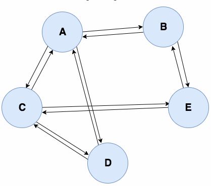

<h1 align="center">[EYNTK] Graphs</h1>

## Graphs
### Definitions
A graph is a set of nodes (called `vertices`), and connections (called `edges`) connecting the different vertices. Graphs are used to represent networks.

In a tree (binary or N-ary), a node can only be connected to its parent and children. In a graph, each vertex can be connected to every other vertex of the graph.

## Undirected graph
A graph is called `undirected` when all edges are `bidirectional`, meaning that if a vertex `A` is connected to a vertex `B`, then `B` is connected to `A`.

The following image shows the graphical representation of an `undirected graph`:


<p align="center">
	
</p>


### Example of usecase
A social network like `Facebook` can be represented using an undirected graph:

* Each vertex represents a person
* On Facebook, if a person `A`is a friend of a person `B`, then they are both connected, we can represent these connections with `bidirectional` edges.

## Directed graph

On the other hand, a graph is called `directed` when at least one edge is `unidirectional`, meaning that if a vertex `A` is connected to a vertex `B`, then `B `is not neccesarily connected to `A` (But it can be, through another edge).

The following image shows the graphical representation of a `directed graph`:

<p align="center">
	
</p>


### Example of usecase
Other social networks like `Twitter`, or `Instagram`, can be represented using directed graphs:

* Each vertex represents a person
* A person `A` can follow a person `B`, but it does not necessarily mean that `B` follows `A` back. Such a connection between `A` and `B` can be represented using a `unidirectional` edge.

### Note
It is simpler to represent an `undirected graph` using only a single connection between two vertices, but as shown in the following image, we can also represent it as a `directed graph`, where each pair of connected vertices is connected using two edges:

<p align="center">
	
</p>

Adjency_array## Weighted graphs

Another possible property of a graph is that its edges can be given a weight.
<p align="center">
	
</p>


### Examples of usecase
We can easily understand the purpose of weighted graphs with a graph representing the time to travel between cities:

* Each vertex represents a city
* The distance divided by the average speed limit between two cities gives us the time it takes to travel between two cities. If we use time as the weight of the edge between two vertices, we can build a graph that can be used to determine the fastest way to go from a city `A` to a city `X`!

## C representation
There are many ways to represent a graph data structure in C. One of the most commonly used is the `Adjacency List`.

### Basic adjacency list
An adjacency list is an array of vertex structures. Each vertex structure contains the data of the vertex, and a pointer to the head node of a linked list. Each node of this linked list represents an edge. An edge structure contains the index of the connected vertex in the vertices array, and a pointer to the next edge in the linked list.

Here is the C struct we could use for an adjacency list:

```
typedef struct edge_s
{
    int dest_index;
    struct edge_s *next;
} edge_t;

typedef struct vertex_s
{
    /* structure content */
    edge_t *edges_head;
} vertex_t;

vertex_t graph[NB_VERTICES];
```

And here is a graphical representation of it:


<p align="center">
	
</p>


## Adjacency linked list
For our project, we are going to use what I call an `adjacency linked list`. Basically, it is the same as the adjacency list described just above, but instead of having an array of vertices, we are going to use a linked list of vertices. The reason is that we would like to be able to add vertices to the graph, without having to realloc the entire array every time (Well, it is the purpose of a linked list..).

On top of that, we are going to store a little bit more information in our `vertex` structure:

* We will store its number of edges. That will allow us to keep track of this number, without having to go through the edges linked list to count them.
* We will also store its index in the adjacency list. This will help us for future algorithms .. ;)

Regarding our `edge` structure, we are now going to store directly a pointer to the connected `vertex`.

Finally, we will define a structure representing our graph, containing a pointer to the head node of the vertices linked list, and the number of vertices in that linked list.

Here is the C definition of our data structures for the project:

```
/* Define the structure temporarily for usage in the edge_t */
typedef struct vertex_s vertex_t;

/**
 * struct edge_s - Node in the linked list of edges for a given vertex
 * A single vertex can have many edges (connections)
 *
 * @dest: Pointer to the connected vertex
 * @next: Pointer to the next edge
 */
typedef struct edge_s
{
    vertex_t    *dest;
    struct edge_s   *next;
} edge_t;

/**
 * struct vertex_s - Node in the linked list of vertices in the adjacency list
 *
 * @index: Index of the vertex in the adjacency list.
 *   When a new vertex is added, this index becomes the number of vertices
 *   in the adjacency list before it is added.
 * @content: Custom data stored in the vertex (here, a string)
 * @nb_edges: Number of connections with other vertices in the graph
 * @edges: Pointer to the head node of the linked list of edges
 * @next: Pointer to the next vertex in the adjacency linked list
 *   This pointer points to another vertex in the graph, but it
 *   doesn't stand for an edge between the two vertices
 */
struct vertex_s
{
    size_t      index;
    char        *content;
    size_t      nb_edges;
    edge_t      *edges;
    struct vertex_s *next;
};

/**
 * struct graph_s - Representation of a graph
 * We use an adjacency linked list to represent our graph
 * All the vertices of the graph are stored in a singly linked list of
 * vertex_t, which head is pointed to by @vertices
 * Each vertex has a pointer @next that points to the next vertex in the list.
 * The @next pointer DOES NOT represent a connection between the two vertices.
 * To represent the connections between vertices, each vertex possesses a singly
 * linked list of edge_t. Each edge structure represents a connection between
 * the vertex and the @dest member of the edge structure. The @next member of
 * an edge points to the next edge in the linked list of edges for a given
 * vertex.
 * Edges are unidirectional. It means that if we want to create a
 * bidirectional connection between two vertices A and B, we need to create
 * two edges: One in the vertex A's edges linked list, pointing to
 * the vertex B, and another one in the vertex B's edges linked list,
 * pointing to the vertex A.
 * @nb_vertices: Number of vertices in our graph
 * @vertices: Pointer to the head node of our adjacency linked list
 */
typedef struct graph_s
{
    size_t      nb_vertices;
    vertex_t    *vertices;
} graph_t;
```
And here is a graphical representation of those structures:

<p align="center">
	
</p>

## Conclusion
I hope this helped understanding graphs and their representation. Now let’s dive in the project! `\o/`
